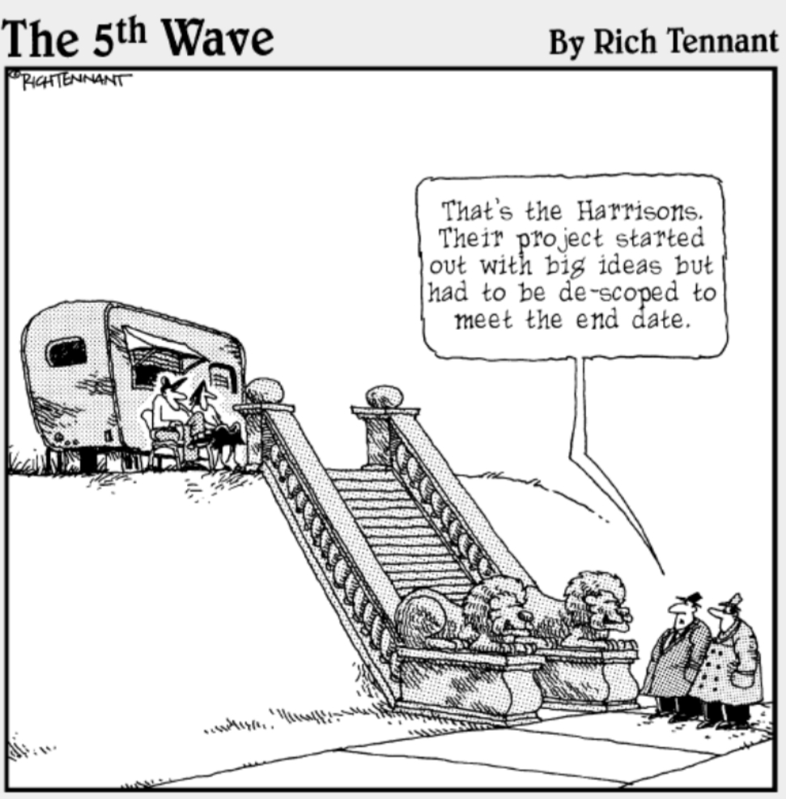

<!-- .slide: data-background="./assets/imgs/NASA-Apollo8-Dec24-Earthrise.jpg" -->
# Project Management

Initiating and executing projects

Notes:

- Introductions
  - CS / Engineer interested in agriculture
  - Joined the Warwick Accelerator
  - Worked at Google for a year
  - Now going to do my PhD at the University of Cambridge
  - DISCLOSURE: I don't claim to be an expert, but I do like thinking about effective PM, especially in the context of startups in agri/food space
- Anecdotally, this is one of my favourite picture - Earthrise (taken from lunar orbit by astronaut William Anders on December 24, 1968, during the Apollo 8 mission)
- You may ask what does this have to do with project management? But what enabled this is effective project management
- Fundamentally PM remains the same and is applicable to all projects, whether it is a space mission or a startup project
- ICEBREAKER: Roundtable quick intros (the team/project you are working on) and a fun fact about yourselves

---

## Agenda 🗓️

--

Session 1: Initiating projects

- Project-business equivalency
- Project charters (aka. one-pagers)
- The power-interest grid
- Identifying & writing SMART objectives
- The Iron Triangle - capturing scope, time and cost

Notes:

- I am aware that you are all at different stages of your business / projects, so I will try to make this as relevant as possible
- Regardless, it is never too late to go back and revisit these things
- Project charter is a more project-focused way of looking at the business canvas (the mentality differs slightly)

--

Interim: Drawing up a project charter

--

Session 2: Executing projects

- Lean
  - Toyota's Lean house
  - Applications outside of manufacturing
  - Minimum Viable Product (MVP)
- Waterfall
- Agile
  - Paradigm shift
  - Manifesto and Principles
  - Scrum (framework for promoting Agility)

--

Extra: Resources and tools

- Trello (Kanban)
- Figma (digital/print prototyping)
- Version control your management docs (these are evolving documents)

---

But first, Julius' word of caution: falling in love with your idea...

---

<!-- .slide: data-background="./assets/imgs/rocket.gif" -->
## Initiating projects

Notes:

- The business canvas is very focused on stakeholders and making money sustainably
- Here we take a project perspective, which is more focused on the project team and delivering value to the stakeholders
- The focus is on identifying and delivering value!

--

### Project-business equivalency

For small businesses and startups

`$$ project \equiv business $$`

Notes:

- Took me while to get to grips with when I was being taught all the PM practices at university
- A lot of project management is managing a breadth of projects in a large organization with a lot of stakeholders, this is not your case!
- You can get away with a lot less
- Being small has its advantages (principally agility)!
  - Focus on the project rather than how the project sits within the wider business
- When I was working on my business / project with the Accelerator, it took me a while to realise that a lot of the PM tasks were not necessary and I could get on with the work of producing the deliverables
  - However, the PM practices are still useful and can help you to deliver value more effectively
  - It's a balance between management and doing the work

--

### Project charters

> A project charter formally authorizes the existence of a project and provides PM with the authority to apply resources.

Notes:

- This comes from large organization where you need to unlock resources to start your project, hence you must justify to the business and stakeholders that it is worth doing
- You don't have a need to justify yourselves to a large organization or business, but it is still a useful exercise to do (justify to yourself and potential funders)
- The project charter allows you to have one document that you can refer back to when you are making decisions about the project
- It allows you to quickly have an overview of the project and remind yourself of the project's objectives
- It can be shared with potential funders, partners to give them a quick and clear understanding of what it is you are doing
- It should be a living document (evolving as the project evolves)

--

#### What is in a project charter?

- Statement of Work (SoW) / mandate
  - What is the project?
  - What are the assumptions?
  - Some high level definition of scope and constraints (budget and time frame)
- Business case (justify the effort and resources)
  - Does this project deliver real value to the business?
  - What similar projects have been done before?

Notes:

- First project document to be developed once you have identified the challenge
- Written before the project initiation document (PID)
- It can be as short as one or two pages and comprises the key elements of the project
- Explains the reasons for the project, the expectations and limitations which apply

--

#### Project charter within wider project management

Idea / identified challenge → Project charter → Project initiation document (PID) → Project plan (and execution cycle)

Notes:

- Gives you an idea of the timeline...
- Believe it or not there is an institution that governs project management, and they have a body of knowledge that defines the best practices for project management
- They have a framework which is called the project management body of knowledge (PMBOK)
- They suggest such a timeline...
- The first thing you do is write down a project charter, which is a one-pager that you can share with stakeholders
- A separate Charter and PID is probably not necessary for startup projects so have omitted that extra step
- Also this linear approach has been widely criticized and is misleading, it implies that the charter is a one-off document that is written at the beginning of the project and then forgotten about (will come back to this later...)
- In practice it is not a linear timeline but can be thought of as a cycle

--

Some good resources from NHS England:

- [Project charter template](https://www.england.nhs.uk/wp-content/uploads/2022/02/qsir-define-your-project-charter.pdf)
- [Project initiation template (PID)](https://www.england.nhs.uk/wp-content/uploads/2021/03/qsir-project-initiation-document.pdf)

Notes:

- We'll go through this template together...

--

### Managing stakeholders

> Stakeholder management is the process of maintaining good relationships with the people who have the most impact on your work.

Notes:

- I see you've already done plenty of work on stakeholder analysis, so there might be some overlap here

--

#### Example stakeholders

- Sponsors (internal or external)
- Customers, end-users
- Sellers
- Partners
- Suppliers
- Governments, regulators...

--

<!-- .slide: data-background="white" -->
#### The power-interest grid

Rule of thumb:

- KS - Involve, engage, consultant (as they pose a risk)
- MC - Involve in decision, communicate regularly
- KI - Make use of interest
- ME - Inform, low priority

Notes:

- The power-interest grid is a tool to help you identify your stakeholders and how to manage them
- I'm going to be honest, I don't think it is massively useful
- But it does provide a formalized way of ensuring who are the key stakeholders and is a quick and easy way to communicate this to your team
- Helps with allocation of resources

--

Exercise: Where do you the following stakeholders lie on the power-interest grid?

1. Senior board member in a large company
2. Customer/end-user
3. A field/subject-expert

Notes:

- Prompting question: for the teams that have government institutions as stakeholders, where do you think they lie on the grid?
- Would anyone like to share their answers?

--

### Objectives

- The project charter lists the project's deliverables/scope (i.e. what we are going to make/do?)
- It also lists the project's objectives/goals (desired outcomes or benefit) (i.e. why are we doing this?)
- Each stakeholder may have different objectives!

--

#### Outputs, outcomes, benefits and objectives

- Output/deliverable - what we're going to produce (the '**what**')
- Outcome - the change that the output will bring about (the '**so what**')
- Benefit - the value that the outcome will bring (the '**why**')
- Objective, which is the projects goals, is the desired/intentional outcomes and/or benefits

--

SMART framework

- Helps to formulate objectives that capture outcomes and benefits in a measurable way
- **S**pecific, **M**easurable, **A**chievable, **R**elevant, **T**ime-bound (i.e. SMART)

E.g.
> To [improve/increase/enhance] [something] by [some amount] by [some date].

--

Some objective antipatterns e.g.:

> - Optimize the system/process
> - Maximize the potential of...
> - We will maintain the service in an ongoing way
> - We will implement x by y

Notes:

- Optimize and maximize are platitudes, so the objectives are unattainable and unspecific
- No mention of when the project will be completed (not time bound)
- We will implement x by y - no clear benefit

--

Worked example

- Output (*what?*): A drone that can monitor crop health in an automated way
- Outcome (*so what?*): Farmers get feedback on crop health regularly without driving to the field
- Benefit (*why is this good?*)
  - Don't damage the crop by passing over it with a tractor
  - Farmer can choose fertilizer and irrigation based off timely crop health data

Notes:

- Drone + software that allows it to be autonomous - output
- Note that the outcome doesn't specify the benefit (it can get a bit confusing)

--

Worked example (continued)

Capture the outcomes and benefits in our SMART Objectives:

1. To increase wheat and barley crop yields by 10% (as a result of better fertilizer and irrigation management) after the first year of deployment on farms in Germany
2. To decrease trampled crop damage due to tractors to nil as a result of using the drone over the first growing season where the drone is deployed
<!-- 3. To decrease fertilizer and irrigation costs by 30% as a result of the drone data-driven recommendations over the first growing season where the drone is deployed -->
<!-- 4. To decrease time spent monitoring crop health from 5h to 1h per week as a result of using the drone over the growing season -->

Notes:

- These objectives are achievable, we can measure to see if we have achieved them
- They are relevant to the project, and they are time bound

--

Exercise:

1. Would you be able to list the output (what?), outcome (so what) and benefits (so why) of your project?
2. Would you be able to capture the outcomes and benefits (hence objectives of the project) in a SMART way?

Notes:

- Ideally, I'd like to hear if anyone could share there output, outcome, benefits with me on the fly and formulate a SMART objective

--

<!-- .slide: data-background="#FFFFFF" -->
### The Iron Triangle

<!-- change size of image -->

- The triangle is rigid
- Quality is constrained by cost, time and scope
- The trick is figuring out where the stakeholders priorities lie

Notes:

- Not sure whether to begin or end talking about the Iron Triangle
- It sort of encompasses all project management in an oversimplified way

--

With many projects, unfortunately, this is the case

Notes:

- You start very ambitiously, and midway through you run out of steam and have to cut corners
- While the iron triangle is sort sudo-science (it's not a law), it does make you reason about the trade-offs you're making when you're working on your project
- It's OK to cut corners, just make sure you're not cutting your head off

--

Notes:

- You can only have two
- For example you can focus on reducing cost and time, but you'll have to cut scope

--

Prompting questions 🤔:

- Can you think of what might be the most limiting factor for startups?
- Are there any potential trade-off decisions you may need to make in your projects?
- Can you tell me what is most valuable to your project (scope, time or cost)?

Notes:

- If you are working in medical technology, scope takes precedence over time and cost
- However as a startup, time is often the limiting factor

---

<!-- .slide: data-background="./assets/imgs/DALL·E 2023-06-21 15.18.00 - person writing and pondering in deep thought as a comic strip art.png" -->
## Interim

Write up your project charter!

--

Recommendations:

- Thinking about important constraints (scope, time, cost) - **what is out-of-scope**?
- Identifying stakeholders
- Identifying benefits (of the outcomes)
- Formulating SMART objectives
- Analysing possible risks

Refer back to the NHS England project charter template, it has extra guidance.

--

[Project charter template](https://docs.google.com/spreadsheets/d/1uYoI4vitq29K4x7hFYJLqLlUUoPmdcdpOSMFnI1dzgA/edit?usp=sharing)

---

<!-- .slide: data-background="./assets/imgs/walking.gif" -->
## Project execution

Lean and Agile

Notes:

- So you have your project charters, your objectives, your stakeholders, your risks, your scope
- You have a plan, but how do you execute it?

--

### Lean

> lean (`/li:n/`), *adjective*
>
> having no superfluous fat
>
> e.g. "Ruth had a lean, muscular body"
>
> - Slim, slender, healthy
> - (Of meat) not fatty
> - Not in excess

--

#### A brief history of Lean

<!-- html to put the images side by side -->

  
  

Notes:

 -Model T produced by Ford from 1908 to 1927 and is generally regarded as the first affordable and mass-produced car
-The Toyota AA was the first car Toyota produced in 1936

--

With the Ford T

- They started with the perceived 'perfect' product
- Strived to add value to the customer by standardizing the production and removing cost from the manufacturing process
- Large batches and economies of scale

With the Toyota AA

- 'seek perfection' and maximize value to the customer
- Remove waste from the manufacturing process (e.g. overproduction, waiting, unnecessary transport, over-processing, excess inventory, unnecessary motion, defects)
- Produce in small batches for a more efficient pipeline (flow)

--

#### Waste

Waste = anything that does not add value to the customer, but we can generalize to anything that does not add value to the project (does not contribute towards the SMART objectives)

Notes:

- The core premise behind Lean is to eliminate waste
- Muri (overburden) - machines and people can not work beyond their capacity
- Muda (wastefulness) - activities that do not add value
- Mura (unevenness) - e.g. having to crunch just before a deadline to meet the deadline

--

#### Eliminating waste

According to Toyota

1. Transport in excess of what is required
2. Inventory in excess of what is required
3. Motion between processes
4. Waiting got processes to finish or people/machines that are unavailable
5. Over processing beyond what is required
6. Overproduction ahead of demand
7. Defects and parsing poor quality down the supply chain
8. Skills not seeking expertise and creativity

--

#### Lean house

--

#### Just-in-case (push) vs just-in-time (pull)

Just-in-case (push): make all we can just in case

- Production approximation
- Large batches
- High inventory
- Management by fire fighting

Just-in-time (pull): make only what is needed when it is needed

- Production to demand
- Small batches
- Low inventory
- Management by sight

--

#### Jidoka (intelligent automation)

Ability to self-monitor and self-correct

--

#### 7 Lean principles of Lean manufacturing

1. Eliminate waste
2. Amplify learning
3. To defer commitment
4. Deliver fast
5. Empower the team
6. Build integrity in
7. See the whole

Notes:

- So how are the Lean principles relevant to us?
- Do you see anything here that would be exclusive to manufacturing?

--

#### Lean manufacturing in action: Kanban

Notes:

- As orders come in, burgers removed from regulator
- Replenished on-demand (JIT) by the kitchen
- Not made to a forecast and pushed to a customer (who may not want a burger) as that would be wasteful

--

--

#### Minimum viable product (MVP)

--

Notes:

- The idea is that it is more valuable to provide a full useful thing rather than parts of a more complex thing
- e.g. you want to provide mobility but don't have the capacity to build a car, so you build a skateboard

--

Lean development

--

### Waterfall

### Agile
